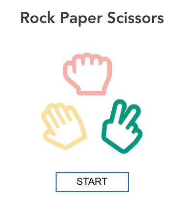
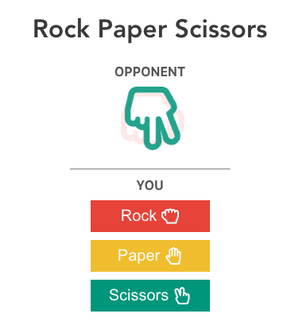
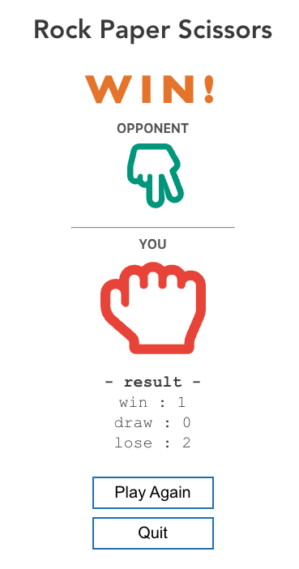

## :newspaper: Rock Paper Scissors Game App

> This is a rock paper scissors game application.
> Demo link : [here](https://emiri-i.github.io/rock-paper-scissors-game/)

## :camera: Screen Shots





## :computer: Technologies Used

[](https://skillicons.dev)

## :star: Features

List the ready features here:

- You can play rock-paper-scissors game.
- It counts how many times you win, draw, and lose.

## :wrench: Setup

1. Clone this repository

```bash
$ git clone https://github.com/Emiri-i/rock-paper-scissors-game.git
```

2. Go into the repository

```bash
$ cd rock-paper-scissors-game
```

3. Install dependencies

```bash
$ npm install
```

4. Run the app

```bash
$ npm run start
```

## :bulb: Room for Improvement

- Add animations on the result screen.
- Create responsive css for mobile devices.

## :blue_book: License

[MIT](https://choosealicense.com/licenses/mit/)
